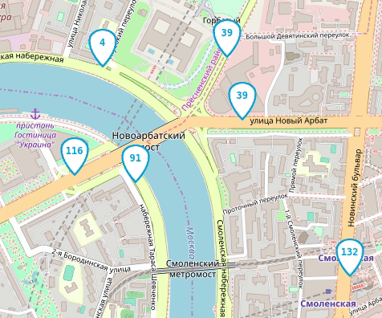
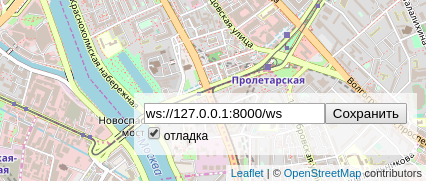

# Автобусы на карте Москвы

Веб-приложение показывает передвижение автобусов на карте Москвы.



## Как запустить

Скачайте код и установите зависимости
```bash
$ python3 -m pip install -r requirements.txt
```
Запустите имитатор движения автобусов
```bash
$ python3 fake_bus.py [-deilnorvw]
```
Запустите сервер
```bash
$ python3 server.py [-dlotv]
```
Откройте в браузере файл index.html

## Настройки

### Бекенд

Список входных параметров и их описание можно посмотреть, вызвав программу с ключом `--help`:
```bash
$ python3 server.py --help
```
Параметры можно сохранить в файле формата `.ini` в папке `configs`, и они будут подгружаться автоматически.

### Фронтенд

Внизу справа на странице можно включить отладочный режим логгирования и указать нестандартный адрес веб-сокета.



Настройки сохраняются в Local Storage браузера и не пропадают после обновления страницы. Чтобы сбросить настройки удалите ключи из Local Storage с помощью Chrome Dev Tools —> Вкладка Application —> Local Storage.

Если что-то работает не так, как ожидалось, то начните с включения отладочного режима логгирования.

## Формат данных

Фронтенд ожидает получить от сервера JSON сообщение со списком автобусов:

```js
{
  "msgType": "Buses",
  "buses": [
    {"busId": "c790сс", "lat": 55.7500, "lng": 37.600, "route": "120"},
    {"busId": "a134aa", "lat": 55.7494, "lng": 37.621, "route": "670к"},
  ]
}
```

Те автобусы, что не попали в список `buses` последнего сообщения от сервера будут удалены с карты.

Фронтенд отслеживает перемещение пользователя по карте и отправляет на сервер новые координаты окна:

```js
{
  "msgType": "newBounds",
  "data": {
    "east_lng": 37.65563964843751,
    "north_lat": 55.77367652953477,
    "south_lat": 55.72628839374007,
    "west_lng": 37.54440307617188,
  },
}
```


## Используемые библиотеки

- [Leaflet](https://leafletjs.com/) — отрисовка карты
- [loglevel](https://www.npmjs.com/package/loglevel) для логгирования


## Цели проекта

Код написан в учебных целях — это урок в курсе по Python и веб-разработке на сайте [Devman](https://dvmn.org).
